<a href="https://akhilrajvadde.com/">
  <picture>
    <source media="(prefers-color-scheme: dark)" srcset="./dark.svg">
    <source media="(prefers-color-scheme: light)" srcset="./light.svg">
    
  </picture>
</a>
 

 

---

### 👋 About

I'm a **Full Stack Developer and AI Engineer** building enterprise banking applications, cloud-native systems and AI-powered automation. My work sits where reliability meets invention: regulated, high-stakes software that still has to feel modern.

- 🏦 **Enterprise & banking:** Finacle Core Banking, payments, reconciliation, compliance-grade delivery
- 🧠 **Generative AI:** RAG knowledge assistants, AI virtual assistants, LLM document extraction (LangChain · LangGraph · Langfuse)
- ☁️ **Cloud & DevOps:** AWS, Docker, Kubernetes and Jenkins CI/CD, carrying it all to production
- ⚡ **Philosophy:** shorten the distance between an idea and something people can use, and let the machine carry the repetitive half

> *"The best engineers do not write more code. They build the thing that writes it."*

---

### 🚀 Signature Work: AUTOFORGE

**An AI engineering platform that writes production code to requirement**

- Turns a written requirement into production-ready code across every language, framework and config format the change needs
- Reads the existing repository for context, so output follows the conventions already in place
- Writes and runs its own tests, validates against enterprise coding standards, and reports what it couldn't resolve rather than guessing
- Drives the full pipeline (build → test → review gate → release), with a human approval step at every irreversible action

`AI Agents` `LLM APIs` `Prompt Engineering` `Python` `Jenkins` `CI/CD` `Docker` `Kubernetes`

---

### ⚙️ What I Build

- **Full-stack engineering:** enterprise applications across the full SDLC with Java, Spring Boot, Python, Node.js, React, Next.js and TypeScript
- **Core banking APIs & microservices:** REST and ASP.NET Web APIs for accounts, payments, transactions and reconciliation
- **Data engineering:** Oracle, PL/SQL, PostgreSQL, MySQL and MongoDB; ETL pipelines, indexing and query tuning; audit-friendly schemas
- **Generative AI:** RAG Knowledge Assistant, customer-facing AI Virtual Assistant, LLM-powered document extraction, with Langfuse observability
- **Python services:** async FastAPI services, idempotent webhooks, AWS Athena analytics
- **Cloud & DevOps:** containerised AWS deployments (EC2, S3, Lambda, RDS, IAM) with Docker, Kubernetes and Jenkins
- **Automation:** Power Apps, Power Automate and Power BI workflows adopted across banking teams

**🎓 B.Tech, Computer Science & Engineering** · Karunya Institute of Technology and Sciences · *2019 – 2023*

---

### 🧩 Featured Projects

| Project | What it is | Stack |
|---|---|---|
| **AUTOFORGE** | Autonomous delivery engine: requirement → tested, standards-checked production code | AI Agents · LLM APIs · Jenkins · K8s |
| **RAG Knowledge Assistant** | Retrieval-augmented assistant for enterprise banking teams; every answer grounded in a cited source | LangChain · LangGraph · Langfuse · FastAPI |
| **Customer AI Virtual Assistant** | Customer-facing conversational assistant plus LLM document extraction in a regulated bank | LLM APIs · Python · Microservices |
| **Finacle Online Banking Platform** | Login management, transaction history and account summaries on Finacle core | Finacle · JavaScript · REST APIs |
| **Activity Tracking & Data Consistency Suite** | Power Apps + Power BI apps for activity logging, file-change monitoring and live insight | Power Apps · Power BI · SharePoint |
| **Real-Time Human Detection & Counting** | Computer-vision system counting people in a live video stream *(B.Tech)* | Python · Computer Vision · ML |
| **Energy-Efficient Underwater Sensor Routing** | Multi-hop routing research to extend node lifetime in underwater WSNs *(B.Tech research)* | Algorithms · Network Simulation |

---

### 🛠️ Engineering Stack

**Languages & Frameworks** 

**Data · Cloud · DevOps** 

**AI & Enterprise** 

 

---

### 🏆 Recognition & Certifications

- 🥇 **Best Tech Star Award (2025–2026)** · *Enterprise AI* — for the AI-powered delivery platform and enterprise AI enablement
- 🏁 **Gen AI Exchange Hackathon** (Google) · **AI For Bharath Hackathon** (AWS)
- 📜 **20 certifications**, including **AWS Certified Generative AI Developer – Professional**, AWS Cloud Technical Essentials, Google Gen AI Exchange, Intel OpenVINO, Cisco Packet Tracer and Java Full Stack Developer

---

### 📊 GitHub Activity

<picture>
  <source media="(prefers-color-scheme: dark)" srcset="https://raw.githubusercontent.com/akhilraj0311/akhilraj0311/output/github-snake-dark.svg">
  <source media="(prefers-color-scheme: light)" srcset="https://raw.githubusercontent.com/akhilraj0311/akhilraj0311/output/github-snake.svg">
  
</picture>

---

### 📫 Let's Build Something Great

Open to conversations about **AI, product engineering and collaboration**. Tell me what you're building.

 

